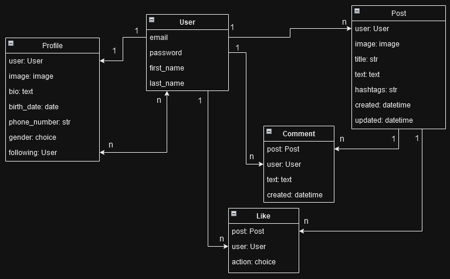

# Social Media API

Social Media API designed to provide a RESTful interface for a social media platform. This API can be used for
create profiles, posts, follow/unfollow other users, add likes/dislikes and comments to posts.

## Table of Contents

- [Features](#features)
- [Installation](#installation)
- [Run with Docker](#Run-with-Docker)
- [Database structure](#Database-structure)

### Features:

- User registration and login with email
- Token-based authentication for user authentication
- Users profile with birthdate, gender, bio and phone number
- Follow/unfollow profiles, view list of followers and following users
- Posts and profiles CRUD operations, view self and following users posts
- Add comments for post
- Add likes, dislikes and remove likes from posts
- Add images for profiles and posts
- Filter profiles and posts
- API documentation

## Installation

1. Clone the repository:
   ```
   git clone https://github.com/V-Shkrobatskyi/social-media-api.git
   cd social-media-api
   python -m venv venv
   venv\Scripts\activate (on Windows)
   source venv/bin/activate (on macOS)
   pip install -r requirements.txt
   ```
2. Copy .env_sample -> env. and populate with required data:
   ```
   POSTGRES_HOST="db host"
   POSTGRES_PORT="db port"
   POSTGRES_NAME="db name"
   POSTGRES_USER="db user"
   POSTGRES_PASSWORD="user password"
   SECRET_key="django secret key"
   ```
3. Run database migrations and start server:
    ```
    python manage.py makemigrations
    python manage.py migrate
    python manage.py runserver
    ```

## Run with Docker

Docker should be installed.

1. Pull docker container:
   ```
   docker pull vitaliitestaccount/social_media_api
   ```
2. Run docker container
   ```
    docker-compose build
    docker-compose up
   ```

## Database structure


